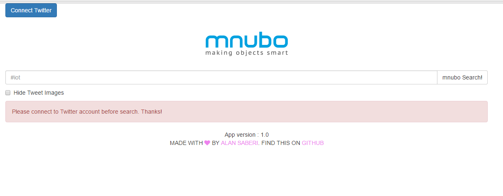
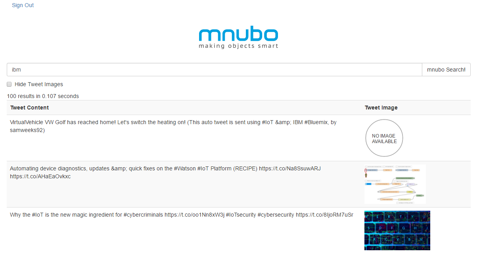

# Small Twitter Search App (MEAN stack)

In this small AngularJS app bundled with NodeJS and Express in the backend. We can search on Twitter about a topic that is involved with Internet of Things (lot) So basically, everything that you type will be combined with #iot and & searched on Twitter search engine.

## Limits by Twitter search API
- The maximum number of result is 100
- Maximum time period is 7 days

## APIs and technologies
- HTML5, CSS, JS, [Bootstrap](http://getbootstrap.com/), [Awesomefont](http://fontawesome.io/)
- [AngularJS](https://angularjs.org/)
- [UI-bootstrap](https://angular-ui.github.io/bootstrap/)
- [NodeJS](https://nodejs.org/en/)
- [Express](http://expressjs.com/)
- [OAuth.io for Open Authentication](https://oauth.io)

## How to make it work on your machine
- Assumptions: You have 'linux like terminal', `node` on your machine
- Clone the repository on your computer
- Run `npm install` to get all of dependencies on the working directory.
- Type `npm start` to get started with `server.js` on the working directory.
- Go to your browser and type `localhost:3000` or `http://localhost:3000/`

